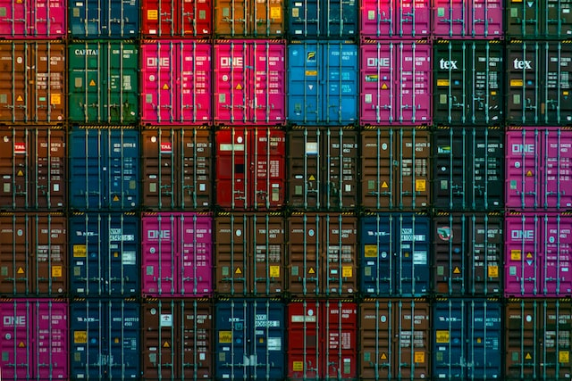

# Data Containers in R

## Impetus

We rarely work with a single datum and instead work with tons of data. As such, we need to be facile in how we deal with lots of data, how it is stored, and how we can efficiently work with it. In this topic, the basics of the following container types are explored.

-   Vectors

-   Matrices

-   Lists

-   Data Frames

## Student Learning Objectives

At the end of this topic, you should be able to:

-   Understand the basic types of data containers available for your data in R and know when one type is preferable over another.

-   Create, *de novo* data representations for each type.

-   Import data from files or internet resources into common data types.

-   Access, edit, update, and delete constituent data components of common data types.

-   Save data to file as either binary R data files or as text files.

## Content

Content for this topic includes both slides and a longer narrative.

-   [Slides](https://dyerlabteaching.github.io/Data-Containers/slides.html#/title-slide) covering data containers
-   A longer [narrative](https://dyerlabteaching.github.io/Data-Containers/narrative.html) that goes into more depth on each of the constituent container types.
-   A record of content developed [in-class](https://dyerlabteaching.github.io/Data-Containers/in-class.html) as part of the instruction on data containers (e.g., the examples created along with the slides).

## Contact Information

If you need to contact me, I am available at:

-   Email: [rjdyer\@vcu.edu](mailto://rjdyer@vcu.edu)
